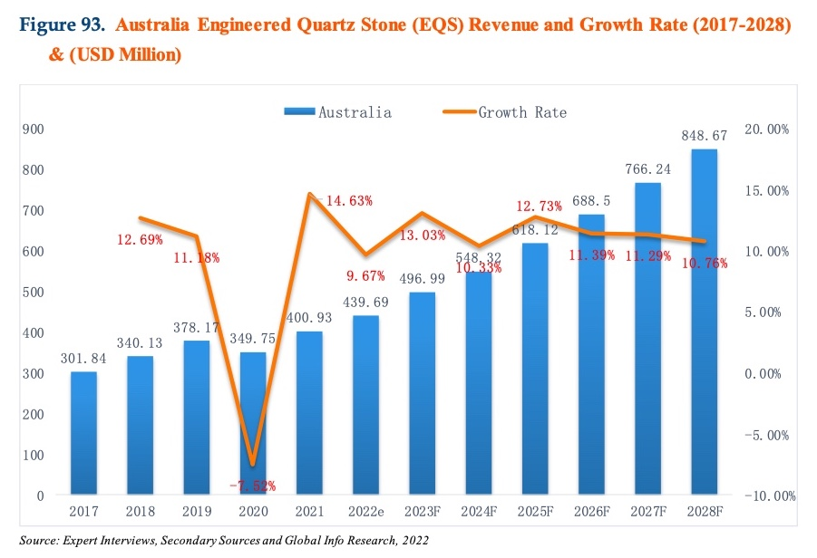

[Home](README.md) - [>> L'impianto](Impianto.md) 

# Il Mercato Australiano

In Australia, nel corso degli anni, si sono verificate le condizioni ideali per
la vendita dei piani cucina in quarzo: 

- Case unifamiliari fra le più grandi
nel mondo 

- Propensione dei consumatori a ristrutturare le case 
- Reddito medio elevato 

- Ampia disponibilità di terreni per edifici ampi con ampie cucine e
bagni 

- Urbanizzazione elevata

Dal 2017 al 2021 le vendite di quarzo sono cresciute del 28%. Le previsioni per
i prossimi anni danno un tasso di crescita medio annuo CAGR 11%.

I principali players sono: - Caesarstone - Quantum Quartz - Silestone -
Smartstone - Essastone

Con tale dimensione del mercato e la sua crescita (stimata in 200.000 m2/anno),
l’ingresso di un nuovo  produttore non può essere veloce, a meno che non abbia
delle argomentazioni sufficientemente forti per  togliere quote di mercato ai
competitor.

Infatti, supponiamo che il nuovo produttore di lastre sia tanto bravo da
riuscire ad assicurarsi tutti  i 200.000 m2/anno di incremento. In questo modo
raggiungerebbe la massima capacità produttiva in tre anni. Ma l'ipotesi di
coprire il 100% della quota di crescita del mercato con concorrenti esperti ed
agguerriti come Ceasarstone, Quantum e Silestone è decisamente irrealistica.

Quindi, quanto sopra dimostra che, per entrare nel ricco mercato delle lastre 
di quarzo in Australia, un nuovo player deve avere una forza commerciale tale 
da riuscire ad acquisire quote di mercato della concorrenza.

## Il target

Il mercato target è composto da principalmente da *fabricators* che producono
i piani cucina con macchine a controllo numerico.

Solo Breton conta XX clienti che hanno acquistano almeno una macchina negli
ultimi 10 anni. Questi clienti a noi conosciuti, che producono principalmente countertops a 
partire da lastre di quarzo, rappresentano una base di partenza che consuma
XX m2 di lastre di quarzo all'anno.

