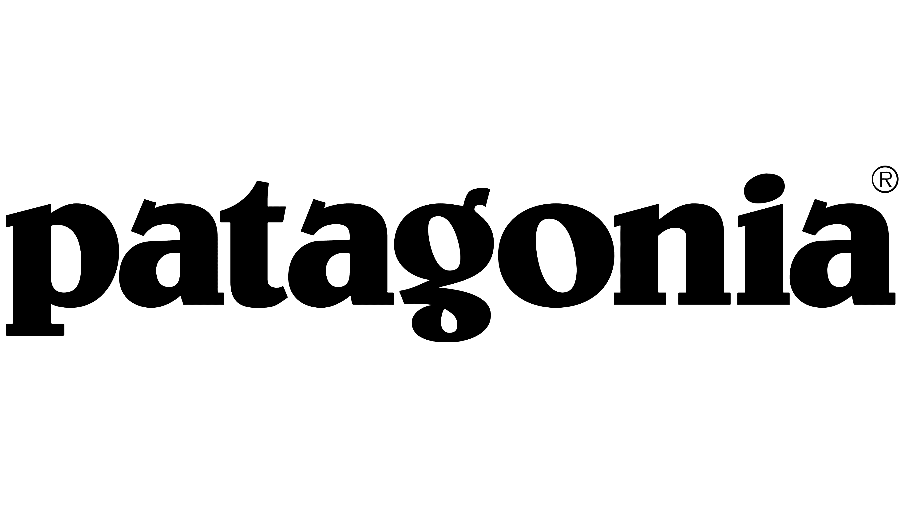

[Home](milionari.html)

# Imprenditori che sono diventati milionari grazie a progetti verdi

- [Yvon Chouinard](patagonia.md), fondatore di Patagonia, ha fatto crescere la sua azienda sostituendo materiali utilizzati negli sport di montagna con alternative ecologiche.
- i cunei di alluminio invece dei chiodi
- pile prodotti con gli scarti delle bottiglie di plastica invece del poliestere tradizionale
- cotone organico al posto del cotone prodotto da agricoltura tradizionale con usop di pesticidi e diserbanti.

- Markus Freitag ha fondato un'azienda che produce borse utilizzando i teloni dei camion. Oggi **Freitag** è diventato un brand di lusso con un fatturato di 26M€ e 20 flagship stores nel mondo.

- Chico Bag è stata fondata nel 2004 da Andy Keller producendo borse con materiali di recupero. Oggi fattura 6M$ all'anno vendendo prodotti realizzati con materiale riciclato. 

- Un esempio più vicino alla nostra proposta è quello di **Chaparral Steel** produttore texano di acciaio riciclato. L'azienda ha iniziato a trasformare le scorie della produzione dell'acciao in cemento Portland. Il CEO Gordon Forward dice di aver sfidato la sua organizzazione a ripensarsi non come un produttore di acciao o di cemento, ma come un'azienda che ha risorse e capacità e che si chiede 'Cosa possiamo fare con queste?'. 
